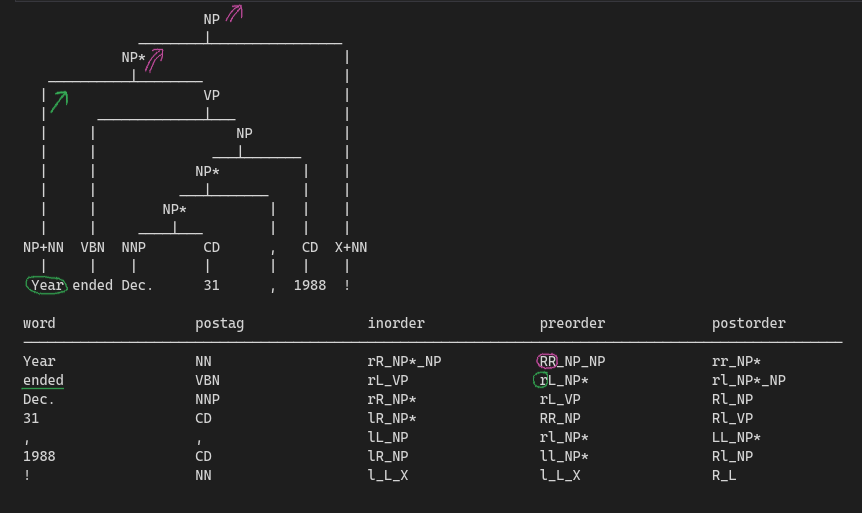

### Tetra-Tagging (preorder, postorder, in-order)
El encoding en preorder y postorder para el tetra-tagging tienen un problema y es que mientras que en in-order cada palabra encodea su direccion respecto a su terminal mas cercano y la direccion de su no-terminal 'siguiente', en preorder las palabras pueden encodear informacion de palabras anteriores (como se ve en la foto la palabra 'ended' esta encodeando la 'r' que indica que 'Year' es un hijo izquierdo). Esto se puede deber a que se está encodeando 'forzosamente' 2 etiquetas (e.g. lR, lL...) por palabra cuando se supone que esto son 'shift', 'reduce' transitions. En el paper [On Parsing as Tagging](https://aclanthology.org/2022.emnlp-main.607.pdf) cuándo hablan de el tagging para preorder y postorder mencionan un paper [A Unifying Theory of Transition-based and Sequence Labeling Parsing](https://aclanthology.org/2020.coling-main.336.pdf) junto al concepto de 'alignment function'. En el paper se convierten parsers de dependencias Arc Eager, Arc Standard etc en etiquetas de 'n' transiciones por etiqueta. <br>



Esta idea se podria aplicar al tetra-tagging haciendo que para cada palabra $w_i$ se encodeen las $n$ etiquetas de acciones que aparecen en el recorrido pre-order/post-order hasta llegar a la palabra $w_{i+1}$. Esto consigue solucionar el problema con el recorrido pre-order, sin embargo para el recorrido post-order tenemos el problema de encodear en la primera palabra las etiquetas de toda la oracion.


Una solucion a este problema podria consistir en cambiar la direccion de binarizacion del arbol. Los previos encodings usan arboles binarizados hacia la derecha, causando que los no terminales se encuentren mmayormente a la derecha del arbol y por lo tanto un post-order traversal siempre vaya hacia las hojas primero. Si binarizamos el arbol hacia la izquierda podriamos conseguir que el recorrido no pase por todas las hojas primero.


Tras cambiar que el post-order sea el unico que utiliza binarizacion hacia la izquierda y hacer que las labels se guarden una vez por palabra obtenemos la siguiente linearizacion. Notar que, a pesar de todo, el numero de etiquetas queda desbalanceado con una gran carga de etiquetas en el ultimo nodo, que se lleva toda la cadena de no-terminales.


Durante el decodificado se ha necesitado cambiar los operadores 'combine' y 'make-node' especificados en [Tetra-Tagging: Word-Synchronous Parsing with Linear-Time Inference](https://aclanthology.org/2020.acl-main.557.pdf) por acciones shift-reduce, debido a que la suposicion de que cada terminal va a tener un solo no-terminal no es cierta para los encodings que usan pre-order y post-order. Los operadores entonces quedan de esta forma:

- Pre-Order traversal
    - $r-(w)$: Insertar la palabra actual $w$ como hijo izquierdo del sub-arbol que este encima del stack
    - $l-(w)$: Insertar la palabra actual $w$ como hijo derecho del sub-arbol que este encima del stack y eliminar elementos del stack hasta encontrar uno que tenga un hijo vacio
    - $R-(NT)$: Crear un nuevo subarbol $nt$ con label $NT$ y dos hijos vacios, insertarlo como hijo izquierdo del top del stack y pushear $nt$ en el stack para que las siguientes inserciones se hagan sobre el
    - $L-(NT)$: Crear un nuevo subarbol $nt$ con label $NT$ y dos hijos vacios, insertarlo como hijo derecho del top del stack y pushear $nt$ en el stack para que las siguientes inserciones se hagan sobre el

- Post-Order traversal
    - $r-(w)$: Insertar un nuevo subarbol con label igual a la palabra actual $w$ en el stack.
    - $l-(w)$: Insertar un nuevo subarbol con label igual a la palabra actual $w$ en el stack o si el top del stack tiene hueco para combinar ese subarbol, combinarlo
    - $R-(NT)$: Crear un nuevo subarbol $nt$ con label $NT$ y dos hijos vacios, insertarlo como hijo izquierdo del top del stack y pushear $nt$ en el stack para que las siguientes inserciones se hagan sobre el
    - $L-(NT)$: Crear un nuevo subarbol $nt$ con label $NT$ y dos hijos vacios, insertarlo como hijo derecho del top del stack y pushear $nt$ en el stack para que las siguientes inserciones se hagan sobre el

- In-Order traversal:
    - See tetratagging paper


### Gaps Encoding

- Similitude with [In-Order Transition-based Constituent Parsing](https://aclanthology.org/Q17-1029.pdf)
- Check the number of gaps that each node closes


- Encoding: Collapse unary chains, binarize to the right and encode the number of right child parents that a node has. Use an in-order traversal to get the non-terminals.<br>
    ```python
    n_gaps = 0
    while node.parent.is_right_child():
        n_gaps+=1
    ```

- Decoding: Given the labels, for each gap, merge or insert the new node<br>
    ``` python
    for i in range(gaps):
        if C_NONE_LABEL in [c.label for c in current_level.children]:
            current_level.children["right"] = new_node
        else:
            current_level = Tree(non_terminal, children=[current_level, new_node])
    ```

### Attach and Juxtapose

Transitions:
- <b>Attach(target_node, parent_label)</b>: 
    - Attach the token as a descendant of target_node. 
    - The parameter parent_label is optional; when provided, we create an internal node labeled parent_label (green) as the parent of the new token. 
    - Parent_label then becomes the rightmost child of target_node (as in Fig. 2 Top). 
    - When parent_label is not provided, the new token itself becomes the rightmost child of target_node
- <b>Juxtapose(target_node, parent_label, new_label)</b>: 
    - Create an internal node labeled new_label (gray) as the shared parent of target_node and the new token. 
    - It then replaces target_node in the tree. 
    - Similar to attach, we can optionally create a parent for the new token via the parent_label parameter

Transitions2Labels:
- <b>Encoding</b>: Usage of partial trees and assign the action needed to get back to the original tree.In order to get the partial trees we remove the leftmost node of the tree and compute the necesary transition to get to it:<br><br>

    

    - One of the problems found during the encoding implementation was that the encoding only works with trees without unary chains. As we were removing nodes from the tree during the obtention of the actions performed, new unary chains appeared that need to be dealt with. This caused a mayor delay in the encoding

- <b>Decoding</b>: Perform the actions specified by the label using the stored information about the parent (for attach) or the parent's parent (for juxtapose)

    - The collapsing of part of speech tags, during the decoding caused problem as nodes were not storing information about their 'parent' node such as in the following example<br>

    

- Para encodear necesitamos guardar el 'numero de niveles' que el current subtree (el rightmost) baja en el arbol; esto puede tener alguna equivalencia con los gaps?
- Los gaps 'storean' el numero de niveles que un nodo sube, esto storea el numero de niveles que un nodo baja?


### Multi-task Learning

- During evaluation, the batch size of the outputs is half of the inputs
	* The evaluation will use all GPUs like the training, so the effective batch size will be the per_device_batch_size multiplied by the number of GPUs (it’s logged at the beginning of the evaluation).
	* During evaluation, take [:n_gpu] and [n_gpu:]?

- CUDA out of memory ==> https://huggingface.co/docs/transformers/v4.19.2/en/performance
	* Control the gradient accumulation with gradient_accumulation_steps=n in training arguments
	* Gradient checkpoints: https://medium.com/tensorflow/fitting-larger-networks-into-memory-583e3c758ff9
	* Use floating point 16 bits activation
	* Change train optimizer to Adafactor
	* Use predict_with_generate = True in training args
	* Change train optimizer to 8-bit Adam
	* Use Accelerator to create a custom training function (see https://huggingface.co/docs/transformers/v4.19.2/en/performance#using-accelerate). This is also used to create quantified models!
	
	
	